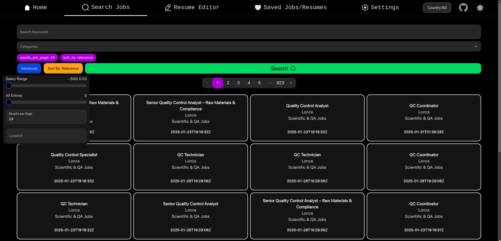

# AI Resume Tool

## Overview

The **AI Resume Tool** is a React + TypeScript (TSX) web application designed to enhance job applications by tailoring resumes to specific job postings. By leveraging AI, it optimizes resumes for **Applicant Tracking Systems (ATS)** to improve job application success rates.

This project highlights the following technologies and concepts:

- **React (TSX)** with **useContext**, custom hooks, and modular structure.
- **Tailwind CSS** for rapid UI development and custom theming (including Dark/Light mode).
- **Hero UI** for standardized React/Tailwind components.
- **Airtable** for cloud-based storage of saved jobs and AI-generated resumes.
- **Multiple API Integrations** (Adzuna, OpenRouter, IPInfo, Airtable).
- **Additional Libraries**:
  - [**pdf-react**](https://www.npmjs.com/package/pdf-react) for handling PDF uploads and parsing.
  - [**axios**](https://axios-http.com/) for HTTP requests.
  - [**qs**](https://www.npmjs.com/package/qs) for query parameter serialization with axios.
  - [**react-toastify**](https://www.npmjs.com/package/react-toastify) for notifications/toasts.

The application is **deployed on Netlify**, enabling easy access and sharing.

---

## Table of Contents

1. [Workflow](#workflow)
2. [Potential Issues & Challenges](#potential-issues--challenges)
3. [Learning Points](#learning-points)
4. [Features](#features)
5. [Folder Structure](#folder-structure-placeholder)
6. [Screenshots](#screenshots)
7. [References](#references)
8. [Future Improvements](#future-improvements)
9. [Conclusion](#conclusion)

---

## Workflow

1. **Project Setup**

   - Initialized a new **Vite** React TypeScript project.
   - Configured **Tailwind CSS** and integrated **Hero UI** for UI components.
   - Set up environment variables in a `.env` file for local development to manage API keys.

2. **Modular Architecture**

   - Embraced **TypeScript** interfaces/types to define data models (e.g., `Job`, `Resume`).
   - Utilized **custom hooks** for data fetching and state management.
   - Used dedicated **services** files to handle API interactions (Airtable, Adzuna, etc.) for maintainability.

3. **API Integrations**

   - **Adzuna** for real-time job listings.
   - **OpenRouter** for AI-driven resume optimization.
   - **IPInfo** for user location detection, setting a default search country.
   - **Airtable** for persisting saved jobs and AI-generated resumes in the cloud.

4. **UI Development**

   - Implemented **Dark/Light Mode** using Tailwind’s dark mode features.
   - Designed interactive **job cards** and **modals** with Hero UI + Tailwind.
   - Incorporated **react-toastify** for success/error notifications.

5. **Airtable Integration & Sync**

   - Dynamically synced and retrieved data from Airtable.
   - Stored **record IDs** for job entries to support updates and deletions.
   - Implemented concurrency checks to handle rate limiting and data conflicts.

6. **Deployment**
   - Deployed on **Netlify** for straightforward hosting and CI/CD integration.
   - Configured environment variables securely within Netlify’s dashboard.

---

## Potential Issues & Challenges

1. **Transition from JSX to TSX**

   - Adjusting to **strict type checking** in TypeScript (especially for API responses and state).
   - Defining interfaces for complex data structures.

2. **useContext and Modular Hooks**

   - Learned **useContext** for global state management, which is more advanced than basic JSX topics.
   - Refactored repeated logic into **custom hooks** for cleaner, more maintainable code.

3. **Airtable Record Management**

   - Storing **record IDs** to allow updates/deletions across sessions.
   - Handling local state after remote edits.

4. **Axios & qs**

   - Moving from `fetch` to **axios** involved learning new concepts like interceptors and advanced error handling.
   - Using **qs** for param serialization to avoid issues with array-based queries.

5. **PDF Parsing**

   - Integrating **pdf-react** for uploading and extracting text from PDFs.
   - Handling inconsistencies in PDF formats with fallback logic.

6. **Strict TypeScript Errors**
   - Encountered compile-time errors due to missing or incorrect types.
   - Embraced the benefits of early bug detection through TypeScript.

---

## Learning Points

1. **TypeScript Fundamentals**

   - Defining clear interfaces for props and states.
   - Leveraging TypeScript’s compile-time checks to prevent runtime errors.

2. **React’s Advanced Features**

   - **useContext** for global states and theming.
   - **Custom hooks** for data fetching, job searching, and resume handling.

3. **APIs & Data Handling**

   - Pagination, filtering, and dynamic queries using **axios** + **qs**.
   - Graceful error handling with toast notifications.

4. **Tailwind & Hero UI**

   - Rapid UI prototyping with Tailwind utility classes.
   - Overriding Hero UI components for consistent design and theming.

5. **Environment Management**

   - Best practices with `.env`, `.gitignore`, and environment variable placeholders on Netlify.

6. **Deployment**
   - Understanding Netlify’s build process (`npm run build`) and environment variable configuration.
   - Managing different setups (local vs. production) effectively.

---

## Features

1. **Home Page**

   - Central navigation with quick links to Search, Saved, Resume Editor, and Settings.

2. **Job Search (Adzuna API)**

   - Dynamic filters (salary range, location, job category, etc.).
   - Paginated results with interactive job cards (modal pop-ups).
   - Favorite/unsave jobs, persisting data to Airtable with record IDs.

3. **Resume Editor (AI-Powered)**

   - Upload PDF (via **pdf-react**) or paste raw text.
   - Select any saved job to reference its details.
   - Generate AI-optimized resume text with **OpenRouter**.
   - Save multiple AI-generated resumes to Airtable.

4. **Saved Jobs & Resumes**

   - Table view of saved jobs with actions (View, Select, Delete).
   - Expandable resumes under each job entry; synced with Airtable.
   - Maintains **record IDs** for reference and updates.

5. **Settings (API Key Management)**

   - Update API keys for various services dynamically.
   - “Reset to Default” functionality to revert to `.env` values.
   - Facilitates easy replication of setup by other users.

6. **Additional Features**
   - **Country Selection Popup** using IPInfo for tailored job results.
   - **Dark/Light Mode Toggle** using Tailwind’s `dark:` classes.
   - **React Toastify** for user-friendly notifications.

---

### Example of AI Response:

---

## Project Tree

```bash
.
├── App.tsx
├── components
│   ├── Home
│   │   └── Home.tsx
│   ├── icons.tsx
│   ├── Navbar
│   │   ├── Components
│   │   │   └── LocationPopup.tsx
│   │   └── navbar.tsx
│   ├── primitives.ts
│   ├── Resume
│   │   ├── Components
│   │   │   ├── ResumeJobCard.tsx
│   │   │   ├── ResumeResult.tsx
│   │   │   └── ResumeUpload.tsx
│   │   └── Resume.tsx
│   ├── Saved
│   │   ├── Components
│   │   │   └── SavedResume.tsx
│   │   └── Saved.tsx
│   ├── Search
│   │   ├── Components
│   │   │   ├── SearchFilter.tsx
│   │   │   ├── SearchPagination.tsx
│   │   │   ├── SearchPostingCard.tsx
│   │   │   ├── SearchPostingModal.tsx
│   │   │   └── SearchResults.tsx
│   │   └── Search.tsx
│   ├── services
│   │   └── services.tsx
│   ├── Settings
│   │   └── Settings.tsx
│   └── theme-switch.tsx
├── config
│   └── site.ts
├── config.tsx
├── hooks
│   ├── addAirtableRecord.ts
│   ├── deleteAirtableRecord.ts
│   ├── FetchAIResponse.ts
│   ├── fetchAirtableData.ts
│   ├── FetchCategories.ts
│   ├── FetchSearchResults.ts
│   └── use-theme.ts
├── images
│   ├── Home-Light.png
│   ├── Home.png
│   ├── LocationPopup.png
│   ├── Resume.png
│   ├── Saved-Close.png
│   ├── Saved-Open.png
│   ├── SearchModal.png
│   ├── Search.png
│   └── Settings.png
├── layouts
│   └── default.tsx
├── main.tsx
├── provider.tsx
├── styles
│   └── globals.css
├── ToastConfig.tsx
├── types
│   └── index.ts
└── vite-env.d.ts
```

---

## Screenshots

| Page                  | Screenshot                                        |
| --------------------- | ------------------------------------------------- |
| **Home Page**         |                |
| **Home Page - Light** |    |
| **Search Jobs**       |            |
| **Job Pop Up**        |       |
| **Resume Editor**     |          |
| **Saved Jobs**        |        |
| **Saved Resume**      |       |
| **Settings Page**     |        |
| **Location Popup**    |  |

---

## Tools and APIs Used

- **React**

  - [React Documentation](https://reactjs.org)
  - [React TypeScript Cheatsheets](https://react-typescript-cheatsheet.netlify.app/docs/basic/setup)

- **Vite**

  - [Vite Official Documentation](https://vitejs.dev)

- **TypeScript**

  - [TypeScript Official Documentation](https://www.typescriptlang.org)

- **Tailwind CSS**

  - [Tailwind CSS Documentation](https://tailwindcss.com)

- **Hero UI**

  - [Headless UI / Heroicons (GitHub)](https://github.com/tailwindlabs/headlessui)

- **Adzuna API**

  - [Adzuna Developer Portal](https://developer.adzuna.com/)

- **OpenRouter API**

  - [OpenRouter Official Site](https://openrouter.ai)

- **IPInfo API**

  - [IPInfo API Documentation](https://ipinfo.io/developers)

- **Airtable API**

  - [Airtable API Documentation](https://airtable.com/api)

- **pdf-react**

  - [pdf-react (npm)](https://www.npmjs.com/package/pdf-react)

- **Axios**

  - [Axios HTTP Documentation](https://axios-http.com/)

- **QS**

  - [qs (npm)](https://www.npmjs.com/package/qs)

- **React Toastify**

  - [react-toastify (npm)](https://www.npmjs.com/package/react-toastify)

- **Environment Variables**
  - [dotenv Documentation](https://github.com/motdotla/dotenv)

---

## Future Improvements

- **Offline Storage**: Implement local caching (e.g., IndexedDB) for saved jobs/resumes.
- **Advanced Search Filters**: Add more filter criteria (e.g., job titles, company names, remote-only listings).
- **Rich Text Resume Editor**: Support formatting (bold, italics, bullet points) in the resume editor UI.
- **Multi-Language Support**: Extend the interface to multiple languages.
- **Role-Based Access**: Implement authentication and user roles if expanded to a multi-user setup.

---

## Conclusion

This project was a **significant learning experience**, demonstrating how to:

1. Migrate from **JSX to TSX** with strict type checking.
2. Implement advanced React concepts like **useContext** and **custom hooks**.
3. Manage external data with **Airtable**, including tracking dynamic record IDs.
4. Parse PDFs using **pdf-react** and handle potential parsing inconsistencies.
5. Use **axios** + **qs** for robust API queries and param serialization.
6. Deploy to **Netlify** for continuous integration and environment variable management.

**Overall**, it showcases building a modern, full-stack React application with **AI integration**, streamlined **UI/UX**, and robust state management. Overcoming hurdles (TypeScript transitions, Airtable syncing, advanced API usage) has reinforced best practices in **web development** and improved adaptability to emerging **web technologies**.

## References

I used AI for certain tasks such as when facing issues with Typescript or styling as I was not entirely familiar with TS and Tailwind. I didn't directly copy code but rather learnt how to correct my mistakes and also styling shorthands for Tailwind. Most of my time was spent reading docs for HeroUI and the APIs. My usage for AI was limited to those things as well as for this Readme file which i asked it to improvise my existing readme. The one thing I directly copied from AI was the prompt that I used for the AI API in my code as my written prompts kept returning vague responses.
